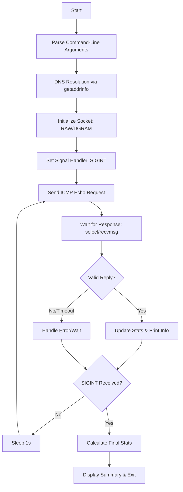

<header>
<h1 align="center">
  <a href="https://github.com/jdecorte-be/ft-ping"></a>
  ft-ping
  <br>
</h1>

<p align="center">
  A high-fidelity re-implementation of the classic ICMP network utility in C, focusing on low-level network programming.
</p>

<p align="center">
<a href="https://www.42.be">
    
  </a>
<a href="#">
    
  </a>
<a href="#">
    
  </a>
<a href="#">
    
  </a>
</p>

<p align="center">
<a href="#">
    
  </a>
  <a href="https://github.com/jdecorte-be/ft-ping/blob/master/LICENSE">
    
  </a>
  <a href="https://github.com/jdecorte-be/ft-ping/stargazers">
    
  </a>
  <a href="https://github.com/jdecorte-be/ft-ping/issues">
    
  </a>
  <a href="https://github.com/jdecorte-be/ft-ping">
    
  </a>
  <a href="https://github.com/jdecorte-be/ft-ping">
    
  </a>
</p>
<p align="center">
  <a href="#key-features">Key Features</a> •
  <a href="#architecture">Architecture</a> •
  <a href="#logic-flow">Logic Flow</a> •
  <a href="#system-flow-diagram">System Flow Diagram</a> •
  <a href="#prerequisites">Prerequisites</a> •
  <a href="#installation">Installation</a> •
  <a href="#1-clone-the-repository">1. Clone the Repository</a>
</p>
</header>

**ft-ping** is a high-fidelity re-implementation of the classic `ping` utility, written in C. This project is a deep dive into low-level network programming, focusing on the Internet Control Message Protocol (ICMP) as defined in **RFC 792**.

The tool verifies the reachability of a remote host and measures the round-trip time (RTT) for packets sent to a destination. It handles packet construction, checksum calculation (RFC 1071), signal management, and precise statistical analysis of network latency.

## Key Features

-   **ICMP Echo Logic**: Implements the core ICMP echo request/reply mechanism to determine host availability.
-   **DNS Resolution**: Resolves hostnames to IPv4 addresses using `getaddrinfo`, accepting both IP addresses and domain names as targets.
-   **Dual Socket Support**: Intelligently attempts to open a `SOCK_RAW` socket (requiring root privileges) and gracefully falls back to `SOCK_DGRAM` if run as a standard user (where supported by the OS).
-   **Precision RTT Statistics**: Calculates minimum, maximum, average, and mean deviation (mdev) of round-trip times using `gettimeofday`.
-   **Robust Checksumming**: A manual implementation of the 16-bit one's complement sum algorithm ensures ICMP header integrity.
-   **Graceful Shutdown**: Intercepts `SIGINT` (Ctrl+C) to terminate the process cleanly and display a comprehensive statistical summary.

## Architecture

### Logic Flow

1.  **Initialization**: Parse command-line arguments.
2.  **Resolution**: Resolve the target hostname into an IPv4 address and `sockaddr_in` structure.
3.  **Socket Creation**: Initialize an ICMP socket. Attempt to use `SOCK_RAW` with root privileges, falling back to `SOCK_DGRAM` if necessary. Drop root privileges immediately after socket binding for enhanced security.
4.  **Main Loop**:
    *   Construct and timestamp an ICMP echo request packet.
    *   Calculate the packet's checksum.
    *   Transmit the packet using `sendto`.
5.  **Reception**:
    *   Wait for an incoming packet using `select` with a timeout.
    *   Receive the packet and parse the IP/ICMP headers.
    *   Validate the packet's process ID and sequence number.
    *   Calculate and display the RTT.
6.  **Termination**: Upon receiving `SIGINT`, calculate the final statistics (including variance and standard deviation) and print a summary before exiting.

### System Flow Diagram



## Prerequisites

-   **Operating System**: Linux (developed and tested on Debian/Ubuntu)
-   **Compiler**: GCC (C99 standard or later)
-   **Build Tools**: `make`
-   **Libraries**: `libc6-dev`
-   **Permissions**: Root privileges (`sudo`) or `cap_net_raw` capabilities are required for `SOCK_RAW` functionality.

## Installation and Building

### 1. Clone the Repository

```bash
git clone https://github.com/jdecorte-be/ft-ping.git
cd ft-ping
```

### 2. Build the Executable

Use the provided `Makefile` to compile the source code.

```bash
make
```

The compiled binary `ft_ping` will be created in the root directory.

### 3. Set Capabilities (Optional)

To run `ft_ping` without `sudo`, you can grant the executable the required network capabilities:

```bash
sudo setcap cap_net_raw+ep ./ft_ping
```

### Docker Environment (Optional)

To build and run the project in an isolated Docker container:

```bash
docker-compose up --build
```

## Usage

The command syntax is designed to be similar to the standard `ping` utility.

### Basic Usage

```bash
# Using sudo
sudo ./ft_ping google.com

# Or with capabilities set
./ft_ping 8.8.8.8
```

### Options

| Flag | Description                  | Example                      |
| :--- | :--------------------------- | :--------------------------- |
| `-v` | **Verbose mode**. Prints detailed packet information. | `./ft_ping -v google.com`    |
| `-h` | **Help**. Displays the usage message and options. | `./ft_ping -h`               |

## Troubleshooting

| Issue                                | Probable Cause                               | Resolution                                                              |
| :----------------------------------- | :------------------------------------------- | :---------------------------------------------------------------------- |
| `Lacking privilege for icmp socket`  | Missing root privileges or capabilities.     | Run with `sudo` or set capabilities using `setcap cap_net_raw+ep ft_ping`. |
| `unknown host`                       | DNS resolution failed or no network access.  | Check your internet connection and DNS settings (e.g., `/etc/resolv.conf`). |
| Checksum mismatch in received packet | Packet corruption or a logic error.          | Ensure the network is stable. If persistent, it may indicate a bug.     |
| Packet reception timeout             | Host is down, or a firewall is blocking ICMP. | Verify the destination host is online and check firewall rules on both ends. |

## Roadmap

-   [ ] **IPv6 Support**: Add support for `ICMPv6` and `AF_INET6`.
-   [ ] **Custom Payload Size**: Implement a `-s` flag to specify the data payload size.
-   [ ] **Custom Interval**: Implement a `-i` flag to change the interval between packets.
-   [ ] **Flood Mode**: Add a `-f` flag for high-frequency sending (superuser only).
-   [ ] **Time To Live (TTL)**: Implement a `-t` flag to set the packet's TTL value.
-   [ ] **Packet Count**: Add a `-c` flag to stop after sending a specific number of packets.

## License

This project is licensed under the MIT License. See the `LICENSE` file for details.
